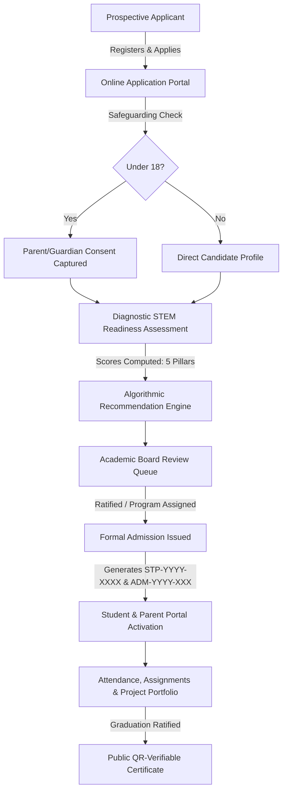

# STEMPACT ACADEMY — Academy Management & Student Portal Platform

[](https://stempact.org)
[](https://react.dev)
[](https://expressjs.com)
[](https://www.prisma.io)
[](https://www.docker.com)
[](#)

---

## 1. Executive Overview

**STEMPACT ACADEMY** is a premier STEM, digital skills, technical, vocational, innovation, and entrepreneurship academy based in **Ile-Ife, Osun State, Nigeria**. 

This platform is a scalable, end-to-end **Academy Management and Student Portal system** connected to an authenticated, relational backend. It unifies public institutional marketing, multi-track admissions, interactive STEM diagnostic assessments, academic board placement reviews, cohort class management, learning progress tracking, child safeguarding consent, and tamper-proof public certificate verification.

---

## 2. Brand Identity & Visual Direction

The platform strictly embodies STEMPACT's official 4-quadrant STEM logo and brand identity:

- **Science (Red)**: `#E11D48` / `#BE123C` — Discovery, biotechnology, inquiry.
- **Technology (Green)**: `#16A34A` / `#15803D` — Software, computing, AI, cybersecurity.
- **Engineering (Blue)**: `#2563EB` / `#1D4ED8` — Robotics, IoT, systems, hardware.
- **Mathematics (Amber/Gold)**: `#D97706` / `#B45309` — Logic, cryptography, analytics, modeling.
- **Institutional Authority (Navy & Slate)**: `#0F172A` / `#1E293B` — Professionalism, structure, security.

The official 4-quadrant STEMPACT logo is preserved with exact geometric proportions in the responsive navigation bar, footer, certificate verification system, and print-ready admission letters.

---

## 3. Academic Structure: 8 Specialized Schools

STEMPACT organizes its offerings into eight specialized academic schools, seeded with 50 comprehensive programs:

| School ID | School Name | Focus Area | Sample Programs |
| :--- | :--- | :--- | :--- |
| `SCH-01` | **School of Computing & Artificial Intelligence** | Modern software, AI/ML, Cloud, Data | Full-Stack Web Dev, Python for AI, Cloud Computing |
| `SCH-02` | **School of Robotics, Hardware & IoT** | Embedded systems, microcontrollers, circuits | Robotics Engineering, Arduino & ESP32 IoT, Drone Systems |
| `SCH-03` | **School of Applied Mathematics & Data Science** | Quantitative reasoning, data analysis, BI | Data Analytics & Power BI, Applied Stats & Modeling |
| `SCH-04` | **School of Creative Technologies & Digital Arts** | UI/UX, Game development, 3D animation | UI/UX Product Design, 3D Game Design with Unity |
| `SCH-05` | **School of Technical & Vocational Excellence** | Solar installation, hardware repairs, electrical | Solar PV Installation, PC Hardware & Electronics Repair |
| `SCH-06` | **School of Cybersecurity & Infrastructure** | Ethical hacking, network defense, compliance | Ethical Hacking, Network Security Administration |
| `SCH-07` | **School of Innovation, Product & Entrepreneurship** | Tech ventures, product management, pitching | Tech Venture Launchpad, Digital Product Management |
| `SCH-08` | **Junior STEM & Young Explorers** | Ages 6–16 foundational computing & logic | Scratch Coding for Kids, Young Robotics Explorers |

---

## 4. Key Workflows & System Architecture



### 4.1 Child Safeguarding & Minor Consent
Applicants under age 18 are automatically identified during application intake. The system requires full parent/guardian details (Full Name, Relationship, Phone, Email, Consent Confirmation) before allowing access to the diagnostic placement assessment.

### 4.2 Diagnostic STEM Placement Engine & Academic Board Review
- **5 Evaluation Pillars**: Digital Literacy, Logic & Problem Solving, Quantitative Reasoning, Technical Aptitude, Creative Thinking.
- **Academic Board Governance**: Placements are **never solely automated**. The system computes benchmark scores and automated recommendations, but sends every application to the **Academic Board Placement Review Queue** in the Admin Console. The Academic Dean / Admin ratifies or modifies the program recommendation, assigns the starting cohort, and issues the official admission.

### 4.3 Unique Identifier Standard
- **Student ID**: `STP-YYYY-XXXX` (e.g., `STP-2025-0142`)
- **Admission Number**: `ADM-YYYY-XXX` (e.g., `ADM-2025-089`)
- **Certificate Number**: `STP-YYYY-XXXX` (e.g., `STP-2027-0001`)

### 4.4 Portals by Persona
1. **Public Website (18 Pages)**:
   - Home, About, Schools, Programs, Program Details, Cohorts, Admissions, Diagnostic Assessment, Innovation Lab, Startup Lab, Competitions, Projects Portfolio, Events, Blog, Contact, FAQ, and Certificate Verification (`/verify/:certNumber`).
2. **Student Portal (`/portal/student`)**:
   - Program timetable, multi-factor module progress %, attendance tracker (`PRESENT`, `LATE`, `ABSENT`), assignment submission portal, invoice payment status, and issued certificates.
3. **Parent / Guardian Portal (`/portal/parent`)**:
   - Strictly scoped view into linked children's academic performance, class attendance records, instructor feedback notes, and invoice management.
4. **Instructor Portal (`/portal/instructor`)**:
   - Class attendance management (mark Present / Late / Absent per session), assignment grading queue, student project supervisor reviews.
5. **Academic & Executive Admin Console (`/portal/admin`)**:
   - High-level KPIs (Total students, active cohorts, revenue, attendance rate), Academic Board Placement Review Queue with 1-click admission issuer, cohort manager, program toggle, and CMS announcements.

---

## 5. Seed Demo Credentials

The database comes pre-seeded with accounts for testing every persona. You can click the **1-Click Quick Fill** buttons on the login page (`/login`) or use the credentials below:

| Persona | Email | Password | Role |
| :--- | :--- | :--- | :--- |
| **Super Admin** | `admin@stempact.org` | `Admin@12345` | Super Admin / Institutional Dean |
| **Academic Admin** | `academic@stempact.org` | `Admin@12345` | Academic Board Administrator |
| **Lead Instructor** | `instructor@stempact.org` | `Instructor@12345` | Senior Technical Instructor |
| **Enrolled Student** | `student@stempact.org` | `Student@12345` | Full-Stack Web Development Scholar |
| **Parent / Guardian** | `parent@stempact.org` | `Parent@12345` | Verified Guardian of Enrolled Student |

---

## 6. Quickstart: Running Locally

### Prerequisites
- **Node.js**: v20.x or v22.x LTS
- **PostgreSQL**: v14, v15, or v16+ running on `localhost:5432`
- **npm** or **pnpm**

### Step 1: Database Setup
Create the PostgreSQL database:
```sql
CREATE DATABASE stempact_db;
```

### Step 2: Backend Setup
```bash
cd server
cp .env.example .env     # adjust DATABASE_URL if needed
npm install
npx prisma generate
npx prisma db push
npm run seed             # Seeds 8 schools, 50 programs, cohorts, questions, and demo users
npm run build
npm start                # Starts API on http://localhost:5000
```

### Step 3: Frontend Setup
In a new terminal:
```bash
cd client
npm install
npm run dev              # Starts client on http://localhost:5173
```

Navigate to `http://localhost:5173` to explore the public site and portals.

---

## 7. Quickstart: Running with Docker Compose

Deploy the entire production stack (PostgreSQL + Express API + Nginx Static React Frontend) in one command:

```bash
docker compose up -d --build
```

- **Frontend Application**: `http://localhost:3000`
- **Backend API**: `http://localhost:5000`
- **PostgreSQL Database**: `localhost:5432`

To run database migrations and initial seeding inside Docker:
```bash
docker compose exec api npx prisma db push
docker compose exec api npm run seed
```

---

## 8. API Reference

| Method | Route | Description | Auth Required |
| :--- | :--- | :--- | :--- |
| `GET` | `/api/health` | System health check and uptime | Public |
| `POST` | `/api/auth/register` | Register prospective applicant / user | Public |
| `POST` | `/api/auth/login` | Authenticate user and receive JWT token | Public |
| `GET` | `/api/auth/me` | Retrieve profile and role metadata | Bearer Token |
| `GET` | `/api/schools` | List all 8 academic schools | Public |
| `GET` | `/api/programs` | Filter programs by school or keyword | Public |
| `GET` | `/api/programs/:id` | Program curriculum, modules, career paths | Public |
| `GET` | `/api/cohorts` | List active cohorts with seat counts | Public |
| `POST` | `/api/applications` | Submit multi-step admission application | Applicant / Public |
| `GET` | `/api/assessment/questions` | Fetch diagnostic placement questions | Authenticated |
| `POST` | `/api/assessment/submit` | Submit answers and compute placement | Authenticated |
| `GET` | `/api/admin/placements` | Academic Board placement queue | Admin |
| `POST` | `/api/admin/ratify-admission` | Ratify placement and issue admission | Admin |
| `GET` | `/api/certificates/verify/:number` | Public tamper-proof certificate lookup | Public |
| `POST` | `/api/payments/initialize` | Initialize Paystack/Flutterwave invoice | Authenticated |

---

## 9. Certificate Verification System

Certificates issued to STEMPACT graduates can be verified publicly by employers, universities, and partners at:
`http://localhost:5173/verify/STP-2027-0001`

Try testing the pre-seeded certificate:
- **Certificate Number**: `STP-2027-0001`
- **Recipient**: David Babatunde Adeyemi
- **Program**: Full-Stack Web Development Bootcamp
- **Grade**: Distinction (`94.5%`)
- **Status**: Officially Verified & Cryptographically Signed

---

## 10. License

Copyright © 2025 STEMPACT ACADEMY. All rights reserved.
Developed for STEM, digital skills, innovation, and technological impact in Osun State and beyond.
